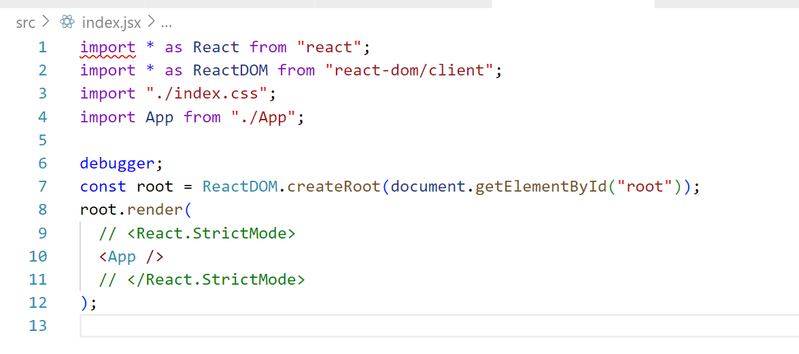

# React 启动时都做了什么？




在cra创建的项目中，我们从index.js文件开始分析，可以看见项目最开始直接执行了 react-dom/client.js 里面的 createRoot 方法，在这里打上debugger标识后我们看一下这个函数都做了哪些工作


可以看见这个函数主要是调用了 `createRootImpl` 这个方法进行接下来的操作，该函数的参数与createRoot一样，接受两个参数：

- container: 必填参数，是用于创建 React root 所在的 DOM 容器。支持 Element、Document 和 DocumentFragment 三种类型。
- options: 可选参数，是 createRoot 的一些配置项。

在开发模式下，`createRoot` 函数还会将 `Internals.usingClientEntryPoint` 设为 `true`，标识当前是从 react-dom/client 中正确引入了 `createRoot`。然后返回 `createRootImpl(container, options)`，最后执行 `Internals.usingClientEntryPoint` 回 `false`。

> 注意：这里的语法比较反直觉，虽然执行了return，最后也还会执行finally里面的语句的，并不会直接返回


继续跳转后会发现，刚刚的createRootImpl其实是从 react-dom/src/client/ReactDOM.js 中导入的createRoot的别名，这里的 createRoot 函数的作用如上，其实还是为了监测运行时相关的内容，即监测开发环境下createRoot是否正确导入(不允许直接从react-dom里面导入)，如果没有正确设置入口点的话，这里就会报错

> 此处留个疑问，为啥不允许从这里直接导入？

接下来继续跳转，来了个大家伙，跳转到了 react-dom/src/client/ReactDOMRoot.js 里面的createRoot上，这个createRoot应该就是真正需要执行的内容，函数内容一步步看

```javascript
export function createRoot(
container: Element | Document | DocumentFragment,
 options?: CreateRootOptions,
): RootType {
    /* 
    * 1. 判断传入的是否是有效的container，无效直接抛出错误
    * 注意：合法的容器类型(通过nodeType判断)有ELEMENT_NODE、DOCUMENT_NODE、				* DOCUMENT_FRAGMENT_NODE和值为' react-mount-point-unstable '的注释节点
    * 神奇的注释节点…
    */
    if (!isValidContainer(container)) {
        throw new Error('createRoot(...): Target container is not a DOM element.');
    }

    /* 
    * 2. 这个函数的作用是用于运行时监测的，主要监测的内容分为以下几部分
    * 2.1 判断容器是不是body元素，是的话弹出警告(不鼓励直接使用 document.body 创建根，因为它的	  * 子项经常被第三方脚本和浏览器扩展程序操作。这可能会导致问题。尝试使用为应用创建的容器元素)
    * 2.2 如果传入的容器是一个之前已经传给 ReactDOM.render()的 container 则弹出警告
    * 2.3 如果传入的容器是一个之前已经传给 createRoot() 的 container 则弹出警告
    * 注意：2.2和2.3的区别在于2.3是根容器，而2.2是根容器下面的容器，其中根容器会具有唯一的key值	  * (internalContainerInstanceKey)，其值为'__reactContainer$' + randomKey，
    * 可以在React内部	通过node[internalContainerInstanceKey]获取该容器
    */
    warnIfReactDOMContainerInDEV(container);

    let isStrictMode = false;	// 严格模式
    let concurrentUpdatesByDefaultOverride = false;	// 
    let identifierPrefix = '';
    let onRecoverableError = defaultOnRecoverableError;
    let transitionCallbacks = null;

    if (options !== null && options !== undefined) {
        if (__DEV__) {
            if ((options: any).hydrate) {
                // 这里的hydrate应该是ssr中水合的概念，估计是历史原因遗留下来的，先不管
                // 现在如果是服务端渲染的话，需要使用hydrateRoot而不是createRoot
                console.warn(
                    'hydrate through createRoot is deprecated. Use ReactDOMClient.hydrateRoot(container, <App />) instead.',
                );
            } else {
                // 真贴心…还担心有人把createRoot的用法和以前的render的用法混合在一起
                if (
                    typeof options === 'object' &&
                    options !== null &&
                    (options: any).$$typeof === REACT_ELEMENT_TYPE
                ) {
                    console.error(
                        'You passed a JSX element to createRoot. You probably meant to ' +
                        'call root.render instead. ' +
                        'Example usage:\n\n' +
                        '  let root = createRoot(domContainer);\n' +
                        '  root.render(<App />);',
                    );
                }
            }
        }
        if (options.unstable_strictMode === true) {
            isStrictMode = true;
        }
        if (
            allowConcurrentByDefault &&
            options.unstable_concurrentUpdatesByDefault === true
        ) {
            concurrentUpdatesByDefaultOverride = true;
        }
        // identifierPrefix：一个 React 用来配合 useId 生成 id 的字符串前缀。在同一个页面上使用多个根节点的场景下，这将能有效避免冲突
        if (options.identifierPrefix !== undefined) {
            identifierPrefix = options.identifierPrefix;
        }
        // onRecoverableError：回调函数，在 React 从异常错误中恢复时自动调用。
        if (options.onRecoverableError !== undefined) {
            onRecoverableError = options.onRecoverableError;
        }
        if (options.transitionCallbacks !== undefined) {
            transitionCallbacks = options.transitionCallbacks;
        }
    }

    // 再跳一层，在createContainer函数中真正开始创建容器的Fiber节点，
    // createContainer函数在下面会展开介绍
    const root = createContainer(
        container,
        ConcurrentRoot,	// 这个是并发模式下根元素对应的tag
        null,
        isStrictMode,
        concurrentUpdatesByDefaultOverride,
        identifierPrefix,
        onRecoverableError,
        transitionCallbacks,
    );
    
    /*
    * 标记容器，其实就是把上面创建好的Fiber节点root挂载到容器dom上面，等价于执行下面内容
    * container[internalContainerInstanceKey] = root.current
    */
    markContainerAsRoot(root.current, container);

    // 获取根容器的实际DOM，主要是为了支持特殊的注释节点
    const rootContainerElement: Document | Element | DocumentFragment =
        container.nodeType === COMMENT_NODE
        ? (container.parentNode: any)
    : container;
    
    // 监听根容器DOM上面的所有事件，这个函数下面也会介绍
    listenToAllSupportedEvents(rootContainerElement);

    // 返回一个只有 _internalRoot 属性的对象，该属性的值为新的 ReactDOMRoot 实例
    return new ReactDOMRoot(root);
}
```



<!-- tab createContainer -->

让我们看看前面提到的 `createContainer` 函数主要都做了些啥，这个函数被定义在react-reconciler/src/ReactFiberReconciler.js 中，其中经历了一次特殊的判断，即采用新Fiber协调器(Fiber架构)还是老Fiber协调器

> 默认是采用老协调器(默认不支持并发特性)，因为并发模式会带来break change，因此React团队希望渐进式更新，即只有使用并发相关特性时才使用新架构

在判断完后实际执行的函数 createContainer 如下(react-reconciler/src/ReactFiberReconciler.old.js 文件) 

```javascript
export function createContainer(
  containerInfo: Container,	// 根容器的DOM元素
  tag: RootTag,
  hydrationCallbacks: null | SuspenseHydrationCallbacks,
  isStrictMode: boolean,
  concurrentUpdatesByDefaultOverride: null | boolean,
  identifierPrefix: string,
  onRecoverableError: (error: mixed) => void,
  transitionCallbacks: null | TransitionTracingCallbacks,
): OpaqueRoot {
  const hydrate = false;	// ssr里面的水合，默认为false
  const initialChildren = null;	// 初始化子组件，默认为null
  // createFiberRoot的内容请继续往下看
  return createFiberRoot(
    containerInfo,
    tag,
    hydrate,
    initialChildren,
    hydrationCallbacks,
    isStrictMode,
    concurrentUpdatesByDefaultOverride,
    identifierPrefix,
    onRecoverableError,
    transitionCallbacks,
  );
}
```

createContainer 函数调用了 react-reconciler/src/ReactFiberReconciler.old.js 文件中的 createFiberRoot 来创建一个FiberRoot，

```javascript
export function createFiberRoot(
  containerInfo: any,
  tag: RootTag,
  hydrate: boolean,
  initialChildren: ReactNodeList,
  hydrationCallbacks: null | SuspenseHydrationCallbacks,
  isStrictMode: boolean,
  concurrentUpdatesByDefaultOverride: null | boolean,
  // TODO:我们有几个这样的参数，它们在概念上是host config的一部分，但因为它们是在运行时传递的，
  // 所以我们必须通过根构造函数传递它们。也许我们应该将它们全部放在一个类型中，比如由渲染器定义的
  // DynamicHostConfig。
  identifierPrefix: string,
  onRecoverableError: null | ((error: mixed) => void),
  transitionCallbacks: null | TransitionTracingCallbacks,
): FiberRoot {
  // 创建一个新的Fiber根节点，该构造函数在下面
  const root: FiberRoot = (new FiberRootNode(
    containerInfo,
    tag,
    hydrate,
    identifierPrefix,
    onRecoverableError,
  ): any);
    
  // 很奇怪，在这个文件里，enableSuspenseCallback是一个false常量…里面的代码不执行，不太符合逻辑，先忽略，反正一路看下来hydrationCallbacks也是个null
  if (enableSuspenseCallback) {
    root.hydrationCallbacks = hydrationCallbacks;
  }

  if (enableTransitionTracing) {
    root.transitionCallbacks = transitionCallbacks;
  }

  // 创建一个未初始化的 Fiber，HostRootFiber是尚未初始化的Fiber树
  const uninitializedFiber = createHostRootFiber(
    tag,
    isStrictMode,
    concurrentUpdatesByDefaultOverride,
  );
    
  // 将根容器对应的FiberRoot的current设置为HostFiberRoot，
  // 同时HostFiberRoot的stateNode为FiberRoot，两者互相引用
  root.current = uninitializedFiber;
  uninitializedFiber.stateNode = root;

  // const enableCache = __EXPERIMENTAL__，实验性的内容，
  if (enableCache) {
    const initialCache = createCache();
    // 引用计数，尽在enableCache的时候生效
    retainCache(initialCache);
    // pooledCache是一个新的缓存示例，在渲染过程中临时用于新挂载的边界(boundaries)
    // 通常，pooledCache总是在渲染结束时从根中清除：
    // 它要么在渲染提交时释放，要么在渲染suspends时移动到离屏组件
    // 由于pooledCache的生存期与主要的memoizedState.cache不同，因此必须单独保留。
    root.pooledCache = initialCache;
    retainCache(initialCache);
    const initialState: RootState = {
      element: initialChildren,
      isDehydrated: hydrate,
      cache: initialCache,
      transitions: null,
      pendingSuspenseBoundaries: null,
    };
    uninitializedFiber.memoizedState = initialState;
  } else {
    const initialState: RootState = {
      element: initialChildren,	// 在csr的时候初始值为null，在ssr时才比较奇特
      isDehydrated: hydrate,
      cache: (null: any), // not enabled yet
      transitions: null,
      pendingSuspenseBoundaries: null,
    };
      
    // hostFiberRoot的memoizedState挂载了该初始值
    uninitializedFiber.memoizedState = initialState;
  }

  // 初始化hostFiberRoot的updateQueue
    /*
    *  const queue: UpdateQueue<State> = {
    *    baseState: fiber.memoizedState,
    *    firstBaseUpdate: null,
    *    lastBaseUpdate: null,
    *	 shared: {
    *	   pending: null,
    *      interleaved: null,
    *      lanes: NoLanes,
    *	 },
    effects: null,
  };
  fiber.updateQueue = queue;
    */
  initializeUpdateQueue(uninitializedFiber);

  return root;
}
```




<!-- tab FiberRootNode -->

FiberRootNode 构造函数

```javascript
function FiberRootNode(
  containerInfo,
  tag,
  hydrate,
  identifierPrefix,
  onRecoverableError,
) {
  this.tag = tag; // 标签
  this.containerInfo = containerInfo; // DOM容器节点
  this.pendingChildren = null; // 待处理的子节点
  this.current = null; // Fiber树
  this.pingCache = null; // Ping缓存
  this.finishedWork = null; // 完成的工作单元
  this.timeoutHandle = noTimeout; // 超时句柄
  this.cancelPendingCommit = null; // 取消待处理的提交
  this.context = null; // 上下文
  this.pendingContext = null; // 待处理的上下文
  this.next = null; // 下一个工作单元
  this.callbackNode = null; // 回调节点
  this.callbackPriority = NoLane; // 回调优先级
  this.expirationTimes = createLaneMap(NoTimestamp); // 过期时间

  this.pendingLanes = NoLanes; // 待处理的Lanes
  this.suspendedLanes = NoLanes; // 暂停的Lanes
  this.pingedLanes = NoLanes; // Ping的Lanes
  this.expiredLanes = NoLanes; // 过期的Lanes
  this.mutableReadLanes = NoLanes;
  this.finishedLanes = NoLanes; // 完成的Lanes

  this.entangledLanes = NoLanes; // 关联的Lanes
  this.entanglements = createLaneMap(NoLanes); // 关联的Lanes映射

  this.identifierPrefix = identifierPrefix; // 标识符前缀
  this.onRecoverableError = onRecoverableError; // 可恢复错误回调函数

  if (enableCache) {
    this.pooledCache = null; // 池缓存，实验性的东西，后面再了解
    this.pooledCacheLanes = NoLanes; // 缓存池的Lanes
  }

  if (supportsHydration) {
    this.mutableSourceEagerHydrationData = null;
  }

  if (enableSuspenseCallback) {
    this.hydrationCallbacks = null; //  挂载回调函数
  }

  if (enableTransitionTracing) {
    this.transitionCallbacks = null;
    const transitionLanesMap = (this.transitionLanes = []);
    for (let i = 0; i < TotalLanes; i++) {
      transitionLanesMap.push(null);
    }
  }

  if (enableProfilerTimer && enableProfilerCommitHooks) {
    this.effectDuration = 0;
    this.passiveEffectDuration = 0;
  }

  if (enableUpdaterTracking) {
    this.memoizedUpdaters = new Set();
    const pendingUpdatersLaneMap = (this.pendingUpdatersLaneMap = []);
    for (let i = 0; i < TotalLanes; i++) {
      pendingUpdatersLaneMap.push(new Set());
    }
  }

  if (__DEV__) {
    switch (tag) {
      case ConcurrentRoot:
        this._debugRootType = hydrate ? 'hydrateRoot()' : 'createRoot()';
        break;
      case LegacyRoot:
        this._debugRootType = hydrate ? 'hydrate()' : 'render()';
        break;
    }
  }
}
```

<!-- endtab -->

<!-- tab createHostRootFiber -->

createHostRootFiber 函数，HostRootFiber是尚未初始化的Fiber树，整个函数其实只做了一件事情，那就是创建了一个tag为HostRoot的fiber节点，并将其mode设置为当前对应的mode，注意该fiber的key为null

```javascript
export function createHostRootFiber(
  tag: RootTag,
  isStrictMode: boolean,
  concurrentUpdatesByDefaultOverride: null | boolean,
): Fiber {
  let mode;
  // 当前从createRoot函数进入后，对应的tag就是ConcurrentRoot
  if (tag === ConcurrentRoot) {
    // 这个if里面，只有第一行代码是有用的，其他的全是源码还没有搞完的部分…
    mode = ConcurrentMode;	// 0000 0001
    
    // isStrictMode是从createRoot一路传递下来的一个配置项，主要用于并发模式的过度，此处我们代码中没有配置该配置项，不用管
    if (isStrictMode === true) {
      mode |= StrictLegacyMode;	// StrictLegacyMode为0000 1000

      // enableStrictEffects 其值为__DEV__，即默认开发模式启用
      if (enableStrictEffects) {
        mode |= StrictEffectsMode;	// StrictEffectsMode为0001 0000
      }
    // createRootStrictEffectsByDefault 也是一个react源码内部的开关，默认为false
    } else if (enableStrictEffects && createRootStrictEffectsByDefault) {
      mode |= StrictLegacyMode | StrictEffectsMode;
    }
      
    // enableSyncDefaultUpdates 始终为true
    if (
      !enableSyncDefaultUpdates ||
      // Only for internal experiments.
      (allowConcurrentByDefault && concurrentUpdatesByDefaultOverride)
    ) {
      mode |= ConcurrentUpdatesByDefaultMode;
    }
  } else {
    mode = NoMode;
  }

  // const enableProfilerTimer = __PROFILE__
  if (enableProfilerTimer && isDevToolsPresent) {
    // Always collect profile timings when DevTools are present.
    // This enables DevTools to start capturing timing at any point–
    // Without some nodes in the tree having empty base times.
    mode |= ProfileMode;
  }

  // 里面执行了new FiberNode(tag, pendingProps, key, mode)
  // 即new FiberNode(HostRoot, null, null mode)
  // HostRoot是fiber的tag常量，用于标识host tree的根fiber
  return createFiber(HostRoot, null, null, mode);
}
```

<!-- endtab -->


<!-- tab FiberNode -->

Fiber节点的工厂函数

```javascript
function FiberNode(
  tag: WorkTag,
  pendingProps: mixed,
  key: null | string,
  mode: TypeOfMode,
) {
  // Instance
  this.tag = tag;
  this.key = key;
  this.elementType = null;
  this.type = null;
  this.stateNode = null;

  // Fiber
  this.return = null;
  this.child = null;
  this.sibling = null;
  this.index = 0;

  this.ref = null;

  this.pendingProps = pendingProps;
  this.memoizedProps = null;
  this.updateQueue = null;
  this.memoizedState = null;
  this.dependencies = null;

  this.mode = mode;

  // Effects
  this.flags = NoFlags;
  this.subtreeFlags = NoFlags;
  this.deletions = null;

  this.lanes = NoLanes;
  this.childLanes = NoLanes;

  this.alternate = null;

  // 性能分析相关，暂时不考虑
  if (enableProfilerTimer) {
    // Note: The following is done to avoid a v8 performance cliff.
    //
    // Initializing the fields below to smis and later updating them with
    // double values will cause Fibers to end up having separate shapes.
    // This behavior/bug has something to do with Object.preventExtension().
    // Fortunately this only impacts DEV builds.
    // Unfortunately it makes React unusably slow for some applications.
    // To work around this, initialize the fields below with doubles.
    //
    // Learn more about this here:
    // https://github.com/facebook/react/issues/14365
    // https://bugs.chromium.org/p/v8/issues/detail?id=8538
    this.actualDuration = Number.NaN;
    this.actualStartTime = Number.NaN;
    this.selfBaseDuration = Number.NaN;
    this.treeBaseDuration = Number.NaN;

    // It's okay to replace the initial doubles with smis after initialization.
    // This won't trigger the performance cliff mentioned above,
    // and it simplifies other profiler code (including DevTools).
    this.actualDuration = 0;
    this.actualStartTime = -1;
    this.selfBaseDuration = 0;
    this.treeBaseDuration = 0;
  }

  // 调试相关的信息
  if (__DEV__) {
    // This isn't directly used but is handy for debugging internals:

    this._debugSource = null;
    this._debugOwner = null;
    this._debugNeedsRemount = false;
    this._debugHookTypes = null;
    if (!hasBadMapPolyfill && typeof Object.preventExtensions === 'function') {
      Object.preventExtensions(this);
    }
  }
}
```

<!-- endtab -->


<!-- tab test -->
**This is Tab 2.**
<!-- endtab -->




<!-- endtab -->

<!-- tab listenToAllSupportedEvents -->

下面就是 listenToAllSupportedEvents 函数的内容，传入的是根元素的DOM节点

```javascript
export function listenToAllSupportedEvents(rootContainerElement: EventTarget) {
  // listeningMarker是一个随机字符串常量，这里用于标识当前的根元素是否已经被监听了
  if (!(rootContainerElement: any)[listeningMarker]) {
    (rootContainerElement: any)[listeningMarker] = true;
    
    // allNativeEvents是在React初始化的时候已经注册好的原生事件集合，是Set类型，值为字符串
    allNativeEvents.forEach(domEventName => {
      // selectionchange事件进行单独处理，因为它不冒泡且需要出现在文档上
      if (domEventName !== 'selectionchange') {
        // nonDelegateEvents是一个string类型的Set，其内容为不应该委托给容器的事件，这些事
        // 件应该设置在实际的目标元素本身上。这主要是因为这些事件在DOM中并不一致。
        if (!nonDelegatedEvents.has(domEventName)) {
          // 在这里处理需要委托给容器的事件，能够委托给容器的事件一定是冒泡事件
          // 第二个参数标识 是否为捕获阶段，这里为处理冒泡事件
          listenToNativeEvent(domEventName, false, rootContainerElement);
        }
        /*
        * 在这里处理捕获事件
        * listenToNativeEvent函数的作用是根据传入的参数的不同注册对应的事件监听器
        * 并校验一些边界情况和做一些兼容性处理
        */
        listenToNativeEvent(domEventName, true, rootContainerElement);
      }
    });

    // 获取到当前根元素的文档对象，并将selectionchange事件绑定到该对象上
    // selectionchange事件允许重复绑定，但是规定只允许绑定到document上
    const ownerDocument =
      (rootContainerElement: any).nodeType === DOCUMENT_NODE
        ? rootContainerElement
        : (rootContainerElement: any).ownerDocument;
    if (ownerDocument !== null) {
      if (!(ownerDocument: any)[listeningMarker]) {
        (ownerDocument: any)[listeningMarker] = true;
        listenToNativeEvent('selectionchange', false, ownerDocument);
      }
    }
  }
}
```


listenToNativeEvent 函数内容如下，简单校验了是否有非预期的行为后，跳转执行  addTrappedEventListener 函数进行事件监听器绑定工作

```javascript
export function listenToNativeEvent(
  domEventName: DOMEventName,
  isCapturePhaseListener: boolean,
  target: EventTarget,
): void {
  if (__DEV__) {
    if (nonDelegatedEvents.has(domEventName) && !isCapturePhaseListener) {
      console.error(
        'Did not expect a listenToNativeEvent() call for "%s" in the bubble phase. ' +
          'This is a bug in React. Please file an issue.',
        domEventName,
      );
    }
  }

  let eventSystemFlags = 0;
  if (isCapturePhaseListener) {
    eventSystemFlags |= IS_CAPTURE_PHASE;
  }
  addTrappedEventListener(
    target,
    domEventName,
    eventSystemFlags,
    isCapturePhaseListener,
  );
}
```


addTrappedEventListener 函数，本质上对传入的dom进行优先级判断后执行 addEventListener 将事件监听器注册到容器DOM上面

```javascript
function addTrappedEventListener(
  targetContainer: EventTarget,
  domEventName: DOMEventName,
  eventSystemFlags: EventSystemFlags,
  isCapturePhaseListener: boolean,
  isDeferredListenerForLegacyFBSupport?: boolean,
) {
  // createEventListenerWrapperWithPriority 函数用于创建当前事件对应的dispatch函数
  // dispatchEvent相关函数有dispatchDiscreteEvent、dispatchContinuousEvent和
  // dispatchEvent，这三个函数的具体定义写在了当前tab的最下方
  let listener = createEventListenerWrapperWithPriority(
    targetContainer,
    domEventName,
    eventSystemFlags,
  );
  // 如果不支持passive选项，那么当前事件会是active和非passive的
  let isPassiveListener = undefined;
      
  // 该标识用于确认浏览器是否支持passive类型的事件监听器
  // 科普下：如果addEventLIstener的passive选项为true的话，浏览器将不会判断回调中是否会执行
  // preventDefault，这样可以让浏览器主线程不需要等待回调执行完毕，从而提高性能，
  // 尤其是滚动或移动端相关的事件
  if (passiveBrowserEventsSupported) {
    // 如果浏览器支持passive的话，则将下方三类事件监听器默认设为passive的
    // 原因在于浏览器引入了默认的行为方式，将下面三种事件在document上的passive选项默认为true，
    // 虽然React从17开始就不在document上绑定事件而是在根容器上绑定事件，17之后似乎没有影响，
    // 但是如果更改回来的话，将会对性能造成影响，因此继续沿用
    // 详见 https://github.com/facebook/react/issues/19651
    if (
      domEventName === 'touchstart' ||
      domEventName === 'touchmove' ||
      domEventName === 'wheel'
    ) {
      isPassiveListener = true;
    }
  }

  // 兼容选项，应该是FB内部有一些项目还在用策略模式(Legacy)，因此兼容
  targetContainer =
    enableLegacyFBSupport && isDeferredListenerForLegacyFBSupport
      ? (targetContainer: any).ownerDocument
      : targetContainer;

  let unsubscribeListener;
      
  // 当legacyFBsupoort被启用且需要阻止监听器的时候，我们需要使用一次性的事件监听器，可以通过下面的方法(劫持原有的监听器)进行处理来确保事件监听器只被调用一次
  if (enableLegacyFBSupport && isDeferredListenerForLegacyFBSupport) {
    const originalListener = listener;
    listener = function (...p) {
      removeEventListener(
        targetContainer,
        domEventName,
        unsubscribeListener,
        isCapturePhaseListener,
      );
      return originalListener.apply(this, p);
    };
  }
      
  if (isCapturePhaseListener) {
    if (isPassiveListener !== undefined) {
      unsubscribeListener = addEventCaptureListenerWithPassiveFlag(
        targetContainer,
        domEventName,
        listener,
        isPassiveListener,
      );
    } else {
      unsubscribeListener = addEventCaptureListener(
        targetContainer,
        domEventName,
        listener,
      );
    }
  } else {
    if (isPassiveListener !== undefined) {
      unsubscribeListener = addEventBubbleListenerWithPassiveFlag(
        targetContainer,
        domEventName,
        listener,
        isPassiveListener,
      );
    } else {
      unsubscribeListener = addEventBubbleListener(
        targetContainer,
        domEventName,
        listener,
      );
    }
  }
}
```


createEventListenerWrapperWithPriority 函数用于获取传入的事件名对应的dispatch事件

```javascript
export function createEventListenerWrapperWithPriority(
  targetContainer: EventTarget,
  domEventName: DOMEventName,
  eventSystemFlags: EventSystemFlags,
): Function {
  // 获取事件优先级，事件主要分为离散事件(DiscreteEvent)和连续事件(ContinuousEvent)
  // 离散事件例如change等，连续事件例如mouseout/mousemove等
  // 除了这两个外，message原生事件还会根据调度的优先级确认为不同的事件类型，但是仍处于实验性质，先不管
  const eventPriority = getEventPriority(domEventName);
  let listenerWrapper;
  switch (eventPriority) {
    case DiscreteEventPriority:
      listenerWrapper = dispatchDiscreteEvent;
      break;
    case ContinuousEventPriority:
      listenerWrapper = dispatchContinuousEvent;
      break;
    case DefaultEventPriority:
    default:
      listenerWrapper = dispatchEvent;
      break;
  }
  return listenerWrapper.bind(
    null,
    domEventName,
    eventSystemFlags,
    targetContainer,
  );
}
```




<!-- tab dispatchDiscreteEvent -->

```javascript
function dispatchDiscreteEvent(
  domEventName,
  eventSystemFlags,
  container,
  nativeEvent,
) {
  const previousPriority = getCurrentUpdatePriority();
  const prevTransition = ReactCurrentBatchConfig.transition;
  ReactCurrentBatchConfig.transition = null;
  try {
    setCurrentUpdatePriority(DiscreteEventPriority);
    dispatchEvent(domEventName, eventSystemFlags, container, nativeEvent);
  } finally {
    setCurrentUpdatePriority(previousPriority);
    ReactCurrentBatchConfig.transition = prevTransition;
  }
}
```

<!-- endtab -->

<!-- tab dispatchContinuousEvent -->

```javascript
function dispatchContinuousEvent(
  domEventName,
  eventSystemFlags,
  container,
  nativeEvent,
) {
  const previousPriority = getCurrentUpdatePriority();
  const prevTransition = ReactCurrentBatchConfig.transition;
  ReactCurrentBatchConfig.transition = null;
  try {
    setCurrentUpdatePriority(ContinuousEventPriority);
    dispatchEvent(domEventName, eventSystemFlags, container, nativeEvent);
  } finally {
    setCurrentUpdatePriority(previousPriority);
    ReactCurrentBatchConfig.transition = prevTransition;
  }
}
```


<!-- endtab -->

<!-- tab dispatchEvent -->

```javascript
export function dispatchEvent(
  domEventName: DOMEventName,
  eventSystemFlags: EventSystemFlags,
  targetContainer: EventTarget,
  nativeEvent: AnyNativeEvent,
): void {
  if (!_enabled) {
    return;
  }
  if (enableCapturePhaseSelectiveHydrationWithoutDiscreteEventReplay) {
    dispatchEventWithEnableCapturePhaseSelectiveHydrationWithoutDiscreteEventReplay(
      domEventName,
      eventSystemFlags,
      targetContainer,
      nativeEvent,
    );
  } else {
    dispatchEventOriginal(
      domEventName,
      eventSystemFlags,
      targetContainer,
      nativeEvent,
    );
  }
}
```


<!-- endtab -->




<!-- endtab -->

<!-- tab ReactDOMRoot -->

ReactDOMRoot 函数就更简单了，只是简单的创建一个ReactDOMRoot对象，并将fiber挂载到_internalRoot属性上去，需要注意的是，ReactDOMRoot的原型链上被挂载了render和unmount两个方法

```javascript
function ReactDOMRoot(internalRoot: FiberRoot) {
  this._internalRoot = internalRoot;
}
```


<!-- endtab -->



