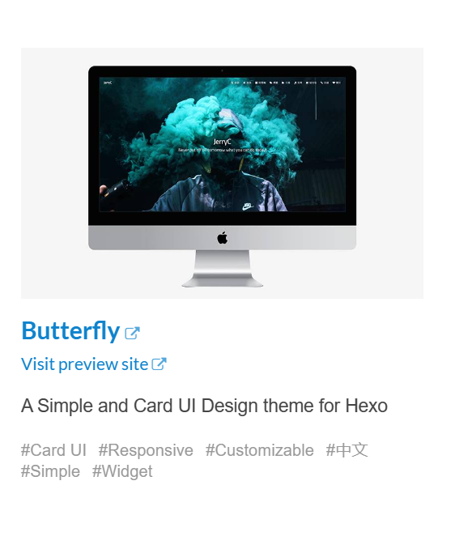

# 使用主题

hexo主题网站：[Themes | Hexo](https://hexo.io/themes/)



进入网站后，选择想要的主题，例如 ***Butterfly*** 这个主题，点击他的标题后会自动跳转到该主题对应的 github 仓库，将该仓库克隆下来即可(例如执行以下语句将该仓库的master分支克隆下来到themes/Butterfly目录下)

`git clone -b master git@github.com:jerryc127/hexo-theme-butterfly.git themes/Butterfly`

克隆完成后将根目录 *_config.yml* 文件中的 theme 字段的值修改为主题的名称(此处的名称为 butterfly)，之后执行hexo三连(`hexo clean` `hexo g` `hexo s`)即可看见更新后的主题

如安装主题过程中出现报错，可在最后一章 **QA** 中寻找解决方案

[hexo 搭建静态博客－高级篇（插件编写） | Frapples的博客](https://frapples.github.io/articles/2016-09-21-6d0.html)

# 插入图片

我个人插入图片的习惯是插入到当前文档同级目录下与文档同名的文件夹下，例如当前编辑的文件是 hexo博客.md ，插入的图片 `1711304380502.png` 的路径则会是 `./hexo博客/1711304380502.png`，但是问题来了，markdown渲染一般情况下图片的写法是 ``，但是hexo生成博客的时候所需要的写法是 ``，如果使用markdown的写法，则会导致hexo生成的博客中没有对应的图片，因此为了解决这个问题，需要对hexo转换过程进行处理，即在hexo最终转换完成之前将markdown对应的语法转换为hexo所需的语法，具体过程如下

1. 在主题文件下的script文件夹中新建一个 `change_image_path.js` 文件，其他名字也行，只需要是js文件就行
2. 在该文件中粘贴以下代码并保存即可

   ```javascript
   hexo.extend.filter.register(
     "before_post_render",	// hexo 提供的生命周期，即在渲染前执行下面函数中的内容
     function (data) {
       const reg = new RegExp(`\.\/${data.title}\/`, "g");
       data.content = data.content.replace(reg, "");
       return data;
     },
     9
   );
   ```
3. 使用hexo三连就可以看到效果了

# QA

Q：使用Hexo搭建博客后出现Cannot GET/

A：在路径 `\source\_posts\`中至少需要存放一篇文档，否则会出现 `Cannot GET/`错误。

Q：克隆主题后控制台报错没有hexo-util这个模块

A：在博客根目录执行 `pnpm install hexo-util -D` 安装hexo-util模块，其他类似报错同理

Q：克隆主题后 `hexo s` 后页面显示 `extends includes/layout.pug block content include ./includes/mixins/post-ui.pug #recent-posts.recent-posts +postUI include includes/pagination.pug`

A：执行  `npm install hexo-renderer-pug hexo-renderer-stylus --save` 命令，安装render-pug模块后依次执行 `hexo clean` `hexo g` `hexo s`
