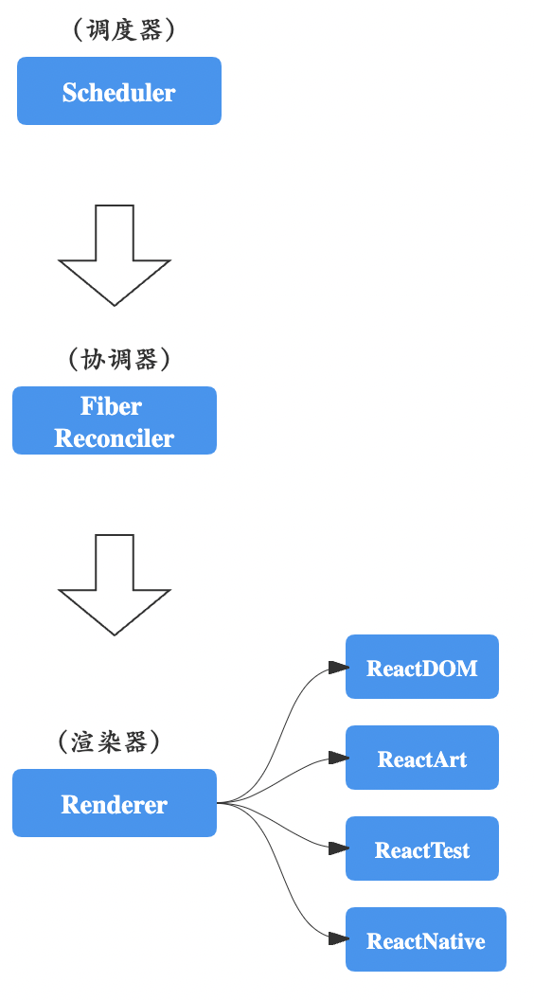

# 调试 React 源码

## React 整体架构

### React Core

React “Core” 中包含所有[全局 `React` API](https://zh-hans.legacy.reactjs.org/docs/react-api.html#react)，比如：

- `React.createElement()`
- `React.Component`
- `React.Children`

**React 核心只包含定义组件必要的 API**。它**不包含**[协调](https://zh-hans.legacy.reactjs.org/docs/reconciliation.html)算法或者其他平台特定的代码。它同时适用于 React DOM 和 React Native 组件。

React 核心代码在源码的 [`packages/react`](https://github.com/facebook/react/tree/main/packages/react) 目录中。在 npm 上发布为 [`react`](https://www.npmjs.com/package/react) 包。相应的独立浏览器构建版本称为 `react.js`，它会导出一个称为 `React` 的全局对象。

### 渲染器

React 最初只是服务于 DOM，但是这之后被改编成也能同时支持原生平台的 [React Native](https://reactnative.dev/)。因此，在 React 内部机制中引入了“渲染器”这个概念。

**渲染器用于管理一棵 React 树，使其根据底层平台进行不同的调用。**

渲染器同样位于 [`packages/`](https://github.com/facebook/react/tree/main/packages/) 目录下：

- [React DOM Renderer](https://github.com/facebook/react/tree/main/packages/react-dom) 将 React 组件渲染成 DOM。它实现了全局 [`ReactDOM`API](https://zh-hans.legacy.reactjs.org/docs/react-dom.html)，这在npm上作为 [`react-dom`](https://www.npmjs.com/package/react-dom) 包。这也可以作为单独浏览器版本使用，称为 `react-dom.js`，导出一个 `ReactDOM` 的全局对象.
- [React Native Renderer](https://github.com/facebook/react/tree/main/packages/react-native-renderer) 将 React 组件渲染为 Native 视图。此渲染器在 React Native 内部使用。
- [React Test Renderer](https://github.com/facebook/react/tree/main/packages/react-test-renderer) 将 React 组件渲染为 JSON 树。这用于 [Jest](https://facebook.github.io/jest) 的[快照测试](https://facebook.github.io/jest/blog/2016/07/27/jest-14.html)特性。在 npm 上作为 [react-test-renderer](https://www.npmjs.com/package/react-test-renderer) 包发布。

另外一个官方支持的渲染器的是 [`react-art`](https://github.com/facebook/react/tree/main/packages/react-art)。它曾经是一个独立的 [GitHub 仓库](https://github.com/reactjs/react-art)，但是现在我们将此加入了主源代码树。

> **注意:**
>
> 严格说来，[`react-native-renderer`](https://github.com/facebook/react/tree/main/packages/react-native-renderer) 实现了 React 和 React Native 的连接。真正渲染 Native 视图的平台特定代码及组件都存储在 [React Native 仓库](https://github.com/facebook/react-native)中。

### reconcilers

即便 React DOM 和 React Native 渲染器的区别很大，但也需要共享一些逻辑。特别是[协调](https://zh-hans.legacy.reactjs.org/docs/reconciliation.html)算法需要尽可能相似，这样可以让声明式渲染，自定义组件，state，生命周期方法和 refs 等特性，保持跨平台工作一致。

为了解决这个问题，不同的渲染器彼此共享一些代码。我们称 React 的这一部分为 “reconciler”。当处理类似于 `setState()` 这样的更新时，reconciler 会调用树中组件上的 `render()`，然后决定是否进行挂载，更新或是卸载操作。

Reconciler 没有单独的包，因为他们暂时没有公共 API。相反，它们被如 React DOM 和 React Native 的渲染器排除在外。

### Stack reconciler

“stack” reconciler 是 React 15 及更早的解决方案。虽然我们已经停止了对它的使用, 但是这在[下一章节](https://zh-hans.legacy.reactjs.org/docs/implementation-notes.html)有详细的文档。

### Fiber reconciler

“fiber” reconciler 是一个新尝试，致力于解决 stack reconciler 中固有的问题，同时解决一些历史遗留问题。Fiber 从 React 16 开始变成了默认的 reconciler。

它的主要目标是：

- 能够把可中断的任务切片处理。
- 能够调整优先级，重置并复用任务。
- 能够在父元素与子元素之间交错处理，以支持 React 中的布局。
- 能够在 `render()` 中返回多个元素。
- 更好地支持错误边界。

你可以在[这里](https://github.com/acdlite/react-fiber-architecture)和[这里](https://medium.com/react-in-depth/inside-fiber-in-depth-overview-of-the-new-reconciliation-algorithm-in-react-e1c04700ef6e)，深入了解 React Fiber 架构。虽然这已经在 React 16 中启用了，但是 async 特性还没有默认开启。

源代码在 [`packages/react-reconciler`](https://github.com/facebook/react/tree/main/packages/react-reconciler) 目录下。

### 事件系统

React 在原生事件基础上进行了封装，以抹平浏览器间差异。其源码在 [`packages/react-dom/src/events`](https://github.com/facebook/react/tree/main/packages/react-dom/src/events) 目录下。

### React v18.2.0 三层架构

- Scheduler（调度器）—— 调度任务的优先级，高优先级的任务会优先进入 `Reconciler`
- Reconciler（协调器）—— 负责找出变化的组件
- Renderer（渲染器）—— 负责将变化的组件渲染到页面上

相比于React v16.0.0 以前的版本，引入了调度器来调度任务的优先级，同时将原先的stack协调器更换为了fiber协调器

React的整体结构如下，其中渲染器可以依赖于不同的实现



#### React源码中packages的目录结构

```bash
packages
├── dom-event-testing-library
├── eslint-plugin-react-hooks
├── jest-mock-scheduler     
├── jest-react
├── react	# React Core
├── react-art	# 另一种 React 渲染器
├── react-cache
├── react-client
├── react-debug-tools
├── react-devtools
├── react-devtools-core     
├── react-devtools-extensions
├── react-devtools-inline   
├── react-devtools-shared   
├── react-devtools-shell    
├── react-devtools-timeline 
├── react-dom		# 浏览器中所用的渲染器，也是我们的主要研究对象
├── react-fetch
├── react-fs
├── react-interactions      
├── react-is
├── react-native-renderer   
├── react-noop-renderer     
├── react-pg
├── react-reconciler        # React协调器
├── react-refresh
├── react-server
├── react-server-dom-relay  
├── react-server-dom-webpack
├── react-server-native-relay
├── react-suspense-test-utils
├── react-test-renderer     
├── scheduler			# React调度器
├── shared				# React项目中的一些共享文件
├── use-subscription        
└── use-sync-external-store 
```


## 解决几个疑惑？

### 整体架构

1. 什么是fiber架构？它解决了什么？
2. react哪些方面存在性能问题？

### React是如何工作的？

1. react在建立的时候做了哪些事情
   - 从 `createRoot` 开始，分析React创建过程中做的事情
   - FiberRoot和Fiber的区别是什么？
2. react在状态更新的过程中做了哪些事情？
   - 调试协调层算法
3. react的状态更新是同步的还是异步的？为什么？实现原理是什么？
   - 18后就是异步的了，React开启了自动批处理，在回调中的状态更新会异步执行进行批处理操作
   - 但是18前存在同步和异步两种区别，当在setTimeout里面执行setState(或者setCount这种hook风格)，这里面的执行就是同步的，即有一条setState就执行一次，但是如果在回调中执行就是异步的，即多条合并执行
   - 实现原理是：
     1. 18后批处理不再依赖于合成事件来实现，因此就不会有异步和同步之分
     2. 18后批处理的底层原理是【待补充】
     3. 注意：React提供了flushSync这个API用于支持强制的同步
4. 【核心】react是按照什么规则复用组件的？
   - 仔细看看源码
5. react的hooks是如何实现的？
   - 观察React源码中 `useState`、`useEffect`、`useContext`、`useRef` 四个经典钩子的原理
   - 看看 `useTransition`、`useDefeeredValue` 是如何执行以及使用的


## 世界的开始——环境搭建

### 准备工作

> 最近在做毕设，毕设的课题中涉及到了React源码的内容，需要对React源码进行分析，在搭建调试环境的时候遇见了很多坑，特此记录
>
> 切记：React 源码不同版本的结构都不太一样，整体思路可以参考文章，如果遇见不同的报错内容请见招拆招，读一读源码 + 善用全局搜索 总能搞定的

#### 所调试源码和调试中所用工具版本

React v18.2.0

node v18.0.0

pnpm v8.15.5

yarn v1.22.22

### 开始

#### 创建项目

我使用的是 create-react-app 创建的项目，整体没啥大坑

> 我后面尝试使用 vite 创建项目后发现项目连 react 源码都识别不了(主要是无法识别 react 源码中flow相关的部分)，怀疑是cra内置了对flow的支持，尝试在vite项目中配置flow环境后，还是不太行，后面有空再看吧

1. 执行 `npx create-react-app cra-test` 创建调试项目

   - 可以先根据个人喜好删掉一些没啥用的东西

2. `cd cra-test` 进入项目根目录后，执行 `rimraf node_modules` 把默认用npm创建的依赖目录给干掉，执行 `pnpm install` 重新安装依赖

   - 出于个人使用喜好，不换应该也没啥大事

3. 在根目录下执行 `pnpm eject` 把webpack目录给调出来，后面需要调整里面的配置

4. `cd src` 进入 src 目录

5. 执行 `git submodule add git@github.com:facebook/react.git` 把react源码克隆到 src 目录下

6. `cd react` 进入 react 目录，执行 `yarn install` 安装对应依赖

   - 安装依赖过程中出现问题的话可以到 QA 章节看看有没有类似的报错，这里不展开

7. 至此，项目基本创建完成，整体目录结构如下所示

   - ```bash
     cra-test
     ├── README.md
     ├── config
     │   ├── env.js
     │   ├── getHttpsConfig.js
     │   ├── jest
     │   │   ├── babelTransform.js      
     │   │   ├── cssTransform.js        
     │   │   └── fileTransform.js       
     │   ├── modules.js
     │   ├── paths.js
     │   ├── webpack
     │   │   └── persistentCache        
     │   ├── webpack.config.js
     │   └── webpackDevServer.config.js 
     ├── package-lock.json
     ├── package.json
     ├── pnpm-lock.yaml
     ├── public
     │   ├── favicon.ico
     │   ├── index.html
     │   ├── logo192.png
     │   ├── logo512.png
     │   ├── manifest.json
     │   └── robots.txt
     ├── scripts
     │   ├── build.js
     │   ├── start.js
     │   └── test.js
     └── src
         ├── App.css
         ├── App.js
         ├── index.css
         ├── index.js
         ├── logo.svg
         └── react
             ├── AUTHORS
             ├── CHANGELOG.md
             ├── CODE_OF_CONDUCT.md     
             ├── CONTRIBUTING.md        
             ├── LICENSE
             ├── README.md
             ├── ReactVersions.js       
             ├── SECURITY.md
             ├── appveyor.yml
             ├── babel.config.js        
             ├── build
             ├── dangerfile.js
             ├── fixtures
             ├── netlify.toml
             ├── package.json
             ├── packages
             ├── scripts
             └── yarn.lock
     ```

#### 启动项目

1. 项目创建完成后，准备开始正式工作了，先打开 `webpack.config.js` ，在文件中搜索 alias，将项目中用到的几个包在项目中起个别名，而不是引用node_module里面的内容，具体替换的内容如下

   ```json
   resolve: {
       alias: {
           react: path.resolve(__dirname, "../cra-test/src/react/packages/react"),
           "react-dom": path.resolve(
               __dirname,
               "../cra-test/src/react/packages/react-dom"
           ),
           "react-dom-bindings": path.resolve(
               __dirname,
               "../cra-test/src/react/packages/react-dom-bindings"
           ),
           "react-reconciler": path.resolve(
               __dirname,
               "../cra-test/src/react/packages/react-reconciler"
           ),
           shared: path.resolve(__dirname, "../cra-test/src/react/packages/shared"),
           scheduler: path.resolve(
               __dirname,
               "../cra-test/src/react/packages/scheduler"
           ),
       },
   }
   ```

2. 修改完后全局搜索 stringified ，添加相关环境变量

   - ```javascript
     const stringified = {
         "process.env": Object.keys(raw).reduce((env, key) => {
             env[key] = JSON.stringify(raw[key]);
             return env;
         }, {}),
         // 添加下面的环境变量
         __DEV__: true,
         __PROFILE__: true,
         __UMD__: true,
         __EXPERIMENTAL__: true,
         __VARIANT__: false,
     };
     ```

3. 返回根目录，执行 `pnpm start` 启动项目，发现控制台输出了一堆报错


### QA

Q：在React根目录使用yarn install时出现如下报错

```bash
error D:\Desktop\code\react\node_modules\gifsicle: Command failed.
Exit code: 1
Command: node lib/install.js
Arguments:
Directory: D:\Desktop\code\react\node_modules\gifsicle
Output:
‼ getaddrinfo ENOENT raw.githubusercontent.com
  ‼ gifsicle pre-build test failed
  i compiling from source
  × Error: Command failed: C:\WINDOWS\system32\cmd.exe /s /c "autoreconf -ivf"    
'autoreconf' �����ڲ����ⲿ���Ҳ���ǿ����еij���
���������ļ���
```

A：在根目录的packages.json中添加如下代码后重新尝试yarn install

```json
"resolutions": {
	"bin-wrapper": "npm:bin-wrapper-china",
}
```


Q：cra项目没有babel的配置文件

A：


